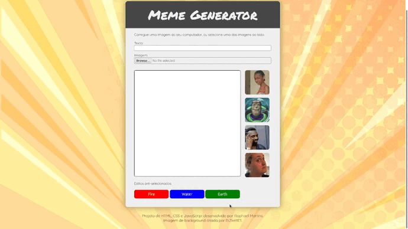
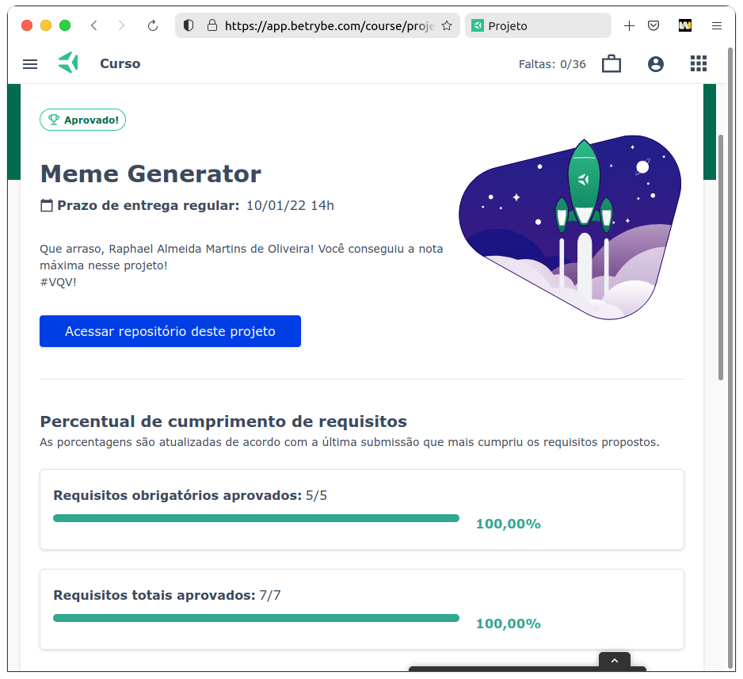

<small>(for the English version, <a href="#en">click here</a>)</small>

# Meme Generator
<h2>:brazil: Português</h2>

Projeto de HTML, CSS e JavaScript desenvolvido por mim (<a href="https://www.linkedin.com/in/raphaelameidamartins/" target="_blank" rel="external">Raphael Martins</a>) ao final do Bloco 5 do Módulo 1 do curso de Desenvolvimento Web da <a href="https://www.betrybe.com" targe="_blank" rel="nofollow">Trybe</a>. Obtive aprovação com 100% dos requisitos obrigatórios e opcionais atingidos, e seguindo as todas as regras de padronização do código e boas práticas do Linter.

O projeto consistiu no desenvolvimento de uma página web dinâmica e interativa em que a pessoa usuária pode criar um meme carregando uma imagem de seu computador/dispositivo e adicionando um texto sobre ela. Também é possível alterar a borda com estilos pré-configurados.

<a href="https://raphaelalmeidamartins.github.io/project-meme-generator/" target="_blank">Clique aqui</a> para conferir o resultado do projeto no navegador.

### Requisitos
<ol>
  <li>Crie uma caixa de texto com a qual quem usa pode interagir para inserir texto em cima da imagem escolhida.
    <ul>
      <li>A caixa onde o texto é inserido deve ter um <code>id</code> denominado <code>text-input</code>;</li>
      <li>Você deve criar um elemento para servir de "container" para a imagem e para o texto do meme. Este elemento deve ter um <code>id</code> denominado <code>meme-image-container</code>;</li>
      <li>Dentro do elemento de container, você deve criar um outro elemento para mostrar o texto digitado. O elemento de texto deve estar totalmente contido dentro do container e ter o <code>id</code> denominado <code>meme-text</code>;</li>
      <li>Se não houver imagem inserida, ele deve ser inserido e estar visível dentro do container vazio onde a imagem aparecerá.</li>
    </ul>
  </li>
  <li>O site deve permitir que quem usa faça upload de uma imagem de seu computador/dispositivo.
    <ul>
      <li>Dentro do elemento de container, você deve criar um outro elemento para mostrar a imagem selecionada. Este elemento deve possuir um <code>id</code> denominado <code>meme-image</code>;</li>
      <li>O elemento onde é feito o upload da imagem deve ser identificado com o <code>id</code> denominado <code>meme-insert</code>. Este elemento não precisa estar dentro do elemento de container;</li>
      <li>A imagem deve estar totalmente contida dentro do elemento identificado como <code>meme-image-container</code> ("totalmente contida" quer dizer que não deve sobrar espaço entre o container e a imagem, e a imagem não deve ultrapassar o tamanho do container);</li>
      <li>O texto inserido no elemento <code>text-input</code> deve ser inserido sobre a imagem escolhida <code>meme-image</code>.</li>
    </ul>
  </li>
  <li>Adicione uma moldura no container. A moldura deve ter 1 pixel de largura, deve ser preta e do tipo <code>solid</code>. A área onde a imagem aparecerá deve ter fundo branco.
    <ul>
      <li>O elemento que serve de container para a imagem deve ter a cor de fundo branca;</li>
      <li>O elemento que serve de container para a imagem deve ter uma borda preta, sólida, com 1 pixel de largura;</li>
    </ul>
  </li>
  <li>Adicione o texto que será inserido sobre a imagem deve ter uma cor, sombra e tamanho específicos.
    <ul>
      <li>O texto do elemento <code>meme-text</code> deve ter uma sombra preta, de 5 pixels na horizontal, 5 pixels na vertical e um raio de desfoque de 5 pixels;</li>
      <li>O texto do elemento <code>meme-text</code> deve ter a fonte com o tamanho de 30 pixels;</li>
    </ul>
  </li>
  <li>Limite o tamanho do texto que o usuário pode inserir.
  <ul>
    <li>A quantidade máxima de caracteres digitáveis no elemento <code>text-input</code> deve ser 60.</li>
  </ul>
  </li>
</ol>

### Bônus
<ol start="6">
  <li>Permita a quem usa customizar o meme escolhido acrescentando a ele uma de três bordas. A página deve ter três botões, que ao serem clicados devem cada um trocar a própria borda ao redor do container.
    <ul>
      <li>As bordas devem ser acrescentadas ao container, identificado como <code>meme-image-container</code>;</li>
      <li>Os três botões devem ser elementos do tipo <code>button</code>;</li>
      <li>Cada elemento <code>button</code> deve ser estilizado para ter a cor de fundo da mesma cor que a moldura que irá colocar no container;</li>
      <li>Cada <code>button</code> deve ter o respectivo <code>id</code> e estilizar o container conforme especificado:
        <ul>
          <li>Um botão identificado com o <code>id</code> chamado <code>fire</code> deve estilizar o container da imagem com uma borda de 3 pixels, dashed e vermelha.</li>
          <li>Um botão com <code>id</code> chamado <code>water</code> deve estilizar o container da imagem com uma borda azul, com 5 pixels do tipo <code>double</code>.</li>
          <li>Um botão com <code>id</code> chamado <code>earth</code> deve estilizar o container da imagem com uma borda do tipo <code>groove</code>, verde e com 6 pixels.</li>
        </ul>
      </li>
      <li>Após uma das três bordas ser selecionada, a borda padrão especificada no requisito 3 não deve mais aparecer;</li>
    </ul>
  </li>
  <li>Tenha um conjunto de quatro imagens pré prontas de memes famosos para o usuário escolher. Mostre miniaturas das imagens e, mediante clique do usuário, essa imagem deve aparecer dentro da moldura do elemento de container.
    <ul>
      <li>O elemento que mostra as miniaturas dos memes deve ser identificado um um <code>id</code> denominado <code>meme-1</code> para o primeiro meme, <code>meme-2</code> para o segundo, <code>meme-3</code> para o terceiro e <code>meme-4</code> para o quarto.</li>
      <li>As imagens que identificam os memes devem ficar dentro da aplicação, num diretório chamado <code>imgs</code> com os respectivos nomes <code>meme1.png</code>, <code>meme2.png</code>, <code>meme3.png</code> e <code>meme4.png</code>. Atenção também para o formato das imagens!</li>
      <li>As imagens devem aparecer dentro do container de forma análoga às imagens enviadas por upload para a página.</li>
    </ul>
  </li>
</ol>
 

<h2 id="en">:us: English</h2>

Project of HTML, CSS and JavaScript develop by me (<a href="https://www.linkedin.com/in/raphaelameidamartins/" target="_blank" rel="external">Raphael Martins</a>) in the end of the Unit 5 Module 1 of the Web Development course at <a href="https://www.betrybe.com" targe="_blank" rel="nofollow">Trybe</a>. I was approved with 100% of the mandatory and optional requirements met, and following all the Linter rules of best practices and code standardization.

We had to develop a dynamic and interactive web page that the user can create a meme by uploading an image from their computer/device and by adding a text on the image. It's also possible to change the image border using pre-set styles.

<a href="https://raphaelalmeidamartins.github.io/project-meme-generator/" target="_blank">Click here</a> to check out the final version of the project on your browser.

### Requirements
<ol>
  <li>Add a text box that the user can insert a text on a chosen image.
    <ul>
      <li>The text box should have <code>text-input</code> as its <code>id</code>;</li>
      <li>You have to create an element that's going to be a "container" for the image and the text of the meme. This element should have <code>meme-image-container</code> as its <code>id</code>;</li>
      <li>Inside this "container" element, you should add another element that's going to display the inserted text on the chosen image. This element should have <code>meme-text</code> as its <code>id</code>;</li>
      <li>Even if there's no inserted image, the text element should still be visible inside the empty container.</li>
    </ul>
  </li>
  <li>The user should be able to upload an image from their computer/device.
    <ul>
      <li>Inside the container, you should add another element that's going to display the inserted image. This element should have <code>meme-image</code> as its <code>id</code>;</li>
      <li>The element where the user can upload the image should have <code>meme-insert</code> as its <code>id</code>. This element doesn't need to be inside the container;</li>
      <li>The inserted image should fill the whole element with <code>meme-image-container</code> as its <code>id</code> (that means there shouldn't be any space left on the element);</li>
      <li>The inserted text <code>text-input</code> should be on the chosen image <code>meme-image</code>.</li>
    </ul>
  </li>
  <li>Add a border to the container. It should be 1 pixel, <code>solid</code> and black. The area where the image is going to be displayed should have white as its background color.
    <ul>
      <li>The container should have white as its background ground color;</li>
      <li>The container should have a 1 pixel solid black border;</li>
    </ul>
  </li>
  <li>The text displayed on the image should have a color, shadow and size as follows:
    <ul>
      <li>The text of the element <code>meme-text</code> should have a black shadow with 5 pixels on the X axis, 5 pixels on the Y axis, and 5 pixels of blur radius;</li>
      <li>The text of the element <code>meme-text</code> should have a font size of 30 pixels;</li>
    </ul>
  </li>
  <li>Limit the length of the text the user is able to input.
  <ul>
    <li>The max length of the element <code>text-input</code> should be 60.</li>
  </ul>
  </li>
</ol>

### Bonus
<ol start="6">
  <li>The user should be able to customize the border of the meme using three pre-defined styles. The page should have three buttons that, when clicked, each one should switch the border of the container.
    <ul>
      <li>The borders should be applied to the element <code>meme-image-container</code>;</li>
      <li>The three buttons should be <code>button</code> elements;</li>
      <li>Each <code>button</code> element should have as its background color the same color that's going to be applied to the border of the container;</li>
      <li>Each <code>button</code> element should have an <code>id</code> and style the container as follows:
        <ul>
          <li>A button with <code>fire</code> as its <code>id</code> should apply to the container a 3 pixels dashed red border.</li>
          <li>A button with <code>water</code> as its <code>id</code> should apply to the container a 5 pixels double blue border.</li>
          <li>A button with <code>earth</code> as its <code>id</code> should apply to the container a 6 pixels groove green border.</li>
        </ul>
      </li>
      <li>After one of the three borders is applied, the default border should no longer appears;</li>
    </ul>
  </li>
  <li>Add to the page four images of famous memes that the user can choose instead of uploading an image. Display miniatures of the images and, when the user clicks in one of them, they should be inserted inside the container as the inserted image.
    <ul>
      <li>The element that displays the miniatures should have <code>meme-1</code> as the <code>id</code> of the first meme, <code>meme-2</code> as the <code>id</code> of the second one, <code>meme-3</code> as the <code>id</code> of the third one, and <code>meme-4</code> as the <code>id</code> of the fourth one.</li>
      <li>The images of these memes should be stored on the server, in a directory named <code>imgs</code> with the respective names: <code>meme1.png</code>, <code>meme2.png</code>, <code>meme3.png</code> and <code>meme4.png</code>. Pay attention to the extension of the files!</li>
      <li>When selected, the images should be displayed inside the container the same way as the uploaded ones.</li>
    </ul>
  </li>
</ol>
